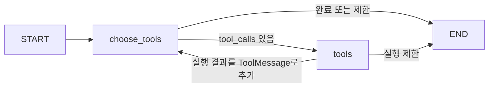

# Agent·Graph 구현 가이드

v0.3 / 2026-09-21. 전체 계층·스택은 [architecture.md](architecture.md)를 참고한다.

## 1. 고정 RAG에서 무엇이 바뀌었나

기존 RAG는 검색 → 생성 → 검증을 항상 같은 순서로 실행했다. 새 Agent는 질문을 보고 어떤 도구가 필요한지 선택하고, 도구 결과를 다음 모델 입력으로 받아 추가 행동을 고른다. 실행 엔진은 LangGraph이고, 도구·모델 인터페이스는 LangChain이다.

기능마다 모델을 다시 만들거나 무제한으로 자율 실행시키지 않는다. 단순 조회는 기존 Python 경로로 처리하고, Agent의 계산·검색·관계 조회는 코드가 허용한 범위 안에서만 실행된다. 최종 숫자는 도구 결과, 설명은 검증된 RAG 결과로 만든다. 계획 모델의 자유 서술은 최종 답변에 사용하지 않는다.

## 2. 직접 읽을 핵심 함수

| 파일·함수 | 읽으면서 확인할 것 |
|---|---|
| `agents/model.py:invoke()` | ChatOpenAI → bind_tools(strict=True) → 비용 예약 → 실행 → usage 정산 |
| `agents/tools.py:ToolContext.build_tools()` | `@tool`과 Pydantic 입력 스키마, 요청 범위를 감싼 closure |
| `agents/tools.py:calculate()` | Decimal 계산, 같은 통화·기간·공시인지 검증 |
| `agents/workflow.py:build_graph()` | StateGraph 노드·조건부 간선·종료 조건 |
| `agents/workflow.py:execute()` | System/Human 메시지와 명시적 기업·기간 범위 |
| `agents/workflow.py:_finalize()` | 계산·근거 관계 누락 시 부분 성공, 설명은 검증된 RAG로 전달 |
| `agents/workflow.py:answer()` | 사용자별 캐시, 중복 실행 잠금, 비용 작업, SQL 감사 기록 |
| `knowledge/ontology.py:build_snapshot()` | 6개 노드 유형·6개 관계, 수치와 서술 근거 구분 |
| `knowledge/graph.py:project()/read()/trace()` | 멱등 투영·실제 Cypher 조회·SQL 기준과 완전 대조 |

## 3. LangGraph 상태와 제어 흐름

상태는 `messages`, `turns`, `tool_count`, `stop_reason`이다. 메시지는 `add_messages`로 누적된다. 모델이 반환한 Tool Call의 이름과 인자를 확인한 후 실행하고, 결과를 해당 `tool_call_id`에 연결한 ToolMessage로 돌려준다. 모델은 실제 관측값 ID를 다음 계산 입력으로 사용할 수 있다.

도구 수와 모델 호출 수는 다르다. 조회 → 계산 → 근거 추적을 한 뒤 종료를 선택하면 모델 선택 4회·도구 실행 3회가 된다. 각 모델 호출에서 누적 메시지를 다시 보내므로 루프가 길어질수록 입력 비용도 커진다.

`intents()`는 요청한 계산·설명·관계가 결과에 포함됐는지 확인하는 최소 규칙이다. 이 함수가 도구 순서를 지정하지는 않는다. 다만 정규식 기반이므로 표현의 누락이나 모든 복합 요구사항을 완벽히 감지하지 못하는 한계가 있다.

## 4. 도구의 계약

| 도구 | 모델이 지정할 입력 | 서버가 강제하는 조건 |
|---|---|---|
| get_financials | 허용 연도·3개 지표 중 선택 | 이번 기업·공시·질문의 기간만 조회 |
| calculate_metrics | 연산 종류·이미 조회한 두 ID | 임의 숫자 불가, 통화·기간·연결 기준·분모 검증 |
| search_filings | 검색 질의 | 고정 document_id, 최대 2회, 결과별 출처 유지 |
| trace_evidence | 이미 조회한 관측값 ID | 실제 Neo4j 경로를 SQL의 기간·금액·출처와 대조 |

기업 ID, SQL, Cypher, Python 코드, 임의 URL을 도구 입력으로 받지 않는다. 프롬프트는 행동을 안내하고, Pydantic·도구 코드·SQL이 실행 권한을 제한한다. 문서 안에 지시문이 있더라도 임의 실행 권한은 생기지 않는다.

증가율은 같은 지표의 연속 연도만 허용한다. 차이·비율은 같은 실제 시작/종료 기간이어야 한다. 현재 분모가 0 이하인 비율은 중단한다. 이는 일반적인 모든 재무 계산을 처리하는 라이브러리가 아니라 앱의 명시적 계산 정책이다.

## 5. Graph가 단순 그림과 다른 점

화면의 관계는 모델이 그린 설명이 아니다. 정규화한 공시 수치로 SQL 스냅샷을 만들고 Neo4j에 저장한 뒤, 실제 조회한 노드·관계를 표시한다. 원본 항목을 누르면 수치의 태그·기간·단위와 공시 URL을 볼 수 있다.

Observation과 Metric을 분리해 같은 ‘매출’의 연도별 값을 구분한다. Evidence도 수치 원본과 서술문을 구분한다. 공시의 서술문이 숫자의 변동 원인을 입증한다는 간선을 자동으로 만들지 않는다. 관계가 있다는 사실과 인과관계가 있다는 주장은 다르다.

LLM이 자유롭게 Cypher를 작성하는 Text-to-Cypher는 사용하지 않았다. 현재 필요한 관계 조회가 명확해 고정된 매개변수 쿼리가 더 간단하고 검증하기 쉽다.

## 6. 실패를 어떻게 다뤘나

2026-09-21 최초 실제 HTTP 개발 평가에서 8개 중 7개가 기준을 통과했다. 삼성전자 반도체 요약은 문단 검색에는 성공했으나, 생성 답변이 회사 전체의 시설투자·사업장·실적을 사업부 맥락에 섞었다. 별도 검토 모델이 근거 범위 불일치를 탐지해 사용자 답변을 보류했다.

처음에는 생성 프롬프트에 사업부 범위와 짧은 주장 지시를 추가했다. 그러나 다음 실행에서 모델이 6개 주장을 반환해 서버의 최대 개수 검증에 걸렸다. 프롬프트의 지시와 API 응답 스키마의 실제 제약이 일치하지 않았던 것이다.

최종 수정은 다음과 같다.

1. 질문한 사업 범위만 답하고, 회사 전체 실적을 추가하지 않도록 생성 지시를 구체화했다.
2. Structured Output 스키마와 Pydantic 검증에 주장 최대 3개·인용 최대 3개·문장 길이 제한을 맞췄다.
3. 생성 temperature를 0으로 고정했다. 이것만으로 정확성이 보장된다고 가정하지 않는다.
4. 검토 기준을 낮추지 않고 동일 개발 질문을 재실행했다.
5. 추가 점검에서 검토 대상이 아닌 `limitations` 필드가 ‘공시 전체에 정보가 없다’고 단정할 수 있음을 발견했다. 사용자 화면에는 서버가 작성한 검색 범위 안내만 표시하도록 수정하고 회귀 테스트를 추가했다.

최종 실제 모델 평가에서 고정 8개 사례의 상태·도구·정확한 계산·인용 문자열·Graph 대조가 모두 통과했다. 이는 개발 과정에서 본 질문을 사용한 **수용 기준 검증**이며 독립 평가 정확도 100%라는 의미가 아니다. 초기 실패와 최종 기록을 `evals/agent-baseline.json`, `evals/agent-report.json`에 남겼다.

| 검증 | 2026-09-21 관측 결과 |
|---|---|
| pytest | 68개 통과. 실제 PostgreSQL·Neo4j, 합성 모델 응답 사용 |
| 프런트 프로덕션 빌드 | 통과 |
| 실제 HTTP + 모델 개발 평가 | 8/8 기준 통과, 그중 5개 AI 실행·3개 사전 범위 차단 |
| 해당 8개 평가의 예상 API 비용 | $0.032146. 사전 인덱싱·이전 실패·서버 비용 제외 |
| 브라우저 확인 | 계산 카드 → 도구 기록 → 관측값 → 원본 항목·공시 링크 탐색 |

평가 시 공시는 이미 색인된 상태였다. 인용 문자열 검사는 의미상 정확성 검사를 대체하지 않는다. pytest의 Starlette/AnyIO deprecation warning 1건은 현재 테스트 통과에 영향을 주지 않았으며 의존성 업데이트 때 확인할 사항이다.

다음 평가에는 미리 보지 않은 질문, 다른 업종·공시 형식, 원인과 단순 동시 변동을 구분해야 하는 질문, 여러 연산이 필요한 질문을 추가해야 한다. 자동 인용 일치와 별도로 사람이 주장 충실성·누락·도구 선택 적절성을 평가해야 한다.

## 7. Skeleton과 실제 설계의 차이

| 재사용 가능한 골격 | 프로젝트별 설계와 검증이 필요한 부분 |
|---|---|
| FastAPI 라우트, React 폼 | 기업·기간 선택을 API와 도구까지 유지하는 계약 |
| `StateGraph` 노드 연결 문법 | 어떤 결과가 있으면 다음 단계/종료/부분 성공인가 |
| `@tool`, Pydantic 정의 문법 | 숫자 대신 검증된 ID를 받는 계산 입력 설계 |
| Neo4j 드라이버 연결 | 관측값 ID, 출처 유형, 잘못된 관계 생성 방지 |
| LLM 요청·응답 처리 | 근거 제한, 인용·의미 검증 분리, 실패 시 답변 유보 |
| DB·환경 설정 | 비용 동시성, 캐시 무효화, 데이터와 Graph 불일치 복구 |

면접에서는 도구 이름을 나열하기보다 “모델에 맡긴 판단과 코드로 강제한 조건”을 설명한다. 예를 들어 “모델은 연산과 관측값을 선택하지만, 조회하지 않은 숫자와 다른 기간의 계산은 서버가 거부한다”를 실제 테스트와 함께 보여줄 수 있다.

## 8. 완성 범위와 다음 운영 과제

현재 요청 단위 Agent와 근거 추적은 동작한다. 멀티턴 장기 기억, durable checkpoint, 장애 후 Agent 재개, 다기업 비교, 범용 GraphRAG, MCP 도구 서버는 아직 없다. 무제한 자율 Agent나 전사 플랫폼 완성이라고 표현하지 않는다.

Neo4j 장애는 관계 기능을 제한하며, PostgreSQL과 결과가 다르면 표시를 중단한다. 두 DB 사이 자동 재처리 큐와 속성 이력 관리가 필요하다. 그래프의 일부 기능은 현재 SQL JOIN으로도 가능한 만큼, 운영 비용과 실제 관계 질의 요구가 Neo4j의 가치를 정당화하는지 계속 확인해야 한다.

프런트의 ‘요청 중지’는 브라우저 대기를 중단한다. 이미 진행 중인 서버·모델 호출의 취소와 비용 환불을 보장하지 않는다. 대규모 배포에서는 서버 취소 전파, 큐, 부하 제한, 관측 도구가 후속 작업이다.
