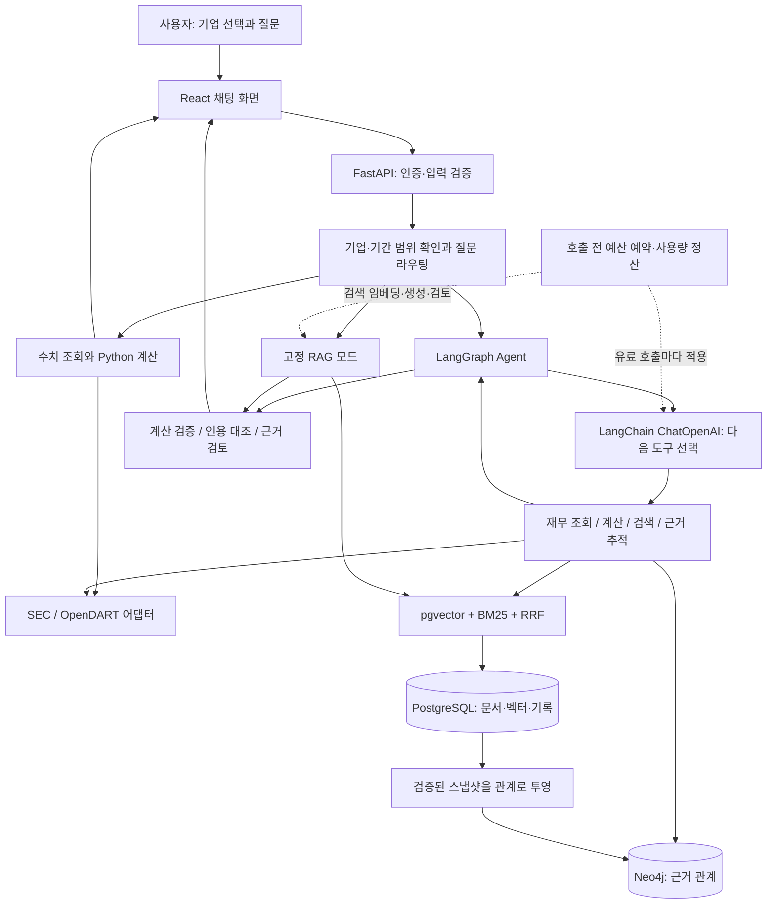
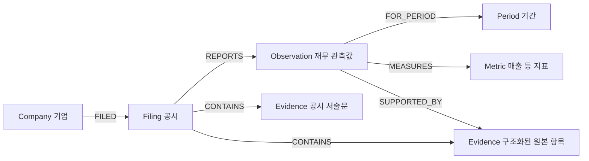

# 재무탐정 전체 구조와 기술 스택

기준: v0.3 / 2026-09-23 문서 검토. 코드로 구현한 범위와 확장 과제를 구분한다. 선택 이유와 대안은 [설계 결정](design-decisions.md), 검증 방법은 [평가 문서](evaluation.md)에 있다.

## 1. 어떤 앱인가

미국 SEC·한국 OpenDART의 기업 공시를 대상으로 **재무 수치 조회 → 코드 계산 → 공시 근거 검색 → 출처 확인**을 지원하는 웹 앱이다. 사용자는 기업을 선택하고 채팅으로 질문한다. 단순 연간 실적 조회에는 LLM을 호출하지 않는다. 복합 질문에는 모델이 허용된 도구를 선택하며, 근거가 부족하면 답변을 보류한다.

현재 지원 지표는 매출·영업이익·영업현금흐름과 이를 이용한 비율·차이·증가율이다. 기업 목록 검색과 모든 기업의 모든 재무 항목 지원은 다르다. 분기, 여러 기업 비교, 투자 예측, 대화 기억은 현재 범위에 포함하지 않는다.

## 2. 한눈에 보는 구조



백엔드는 모듈을 분리한 **단일 FastAPI 애플리케이션**이다. PostgreSQL과 Neo4j는 Docker Compose로, Python 서버와 Vite 개발 서버는 로컬 프로세스로 실행한다. 프런트 빌드 후에는 FastAPI가 React 정적 파일도 제공한다.

## 3. 기술 스택과 선택 이유

| 영역 | 사용하는 기술 | 실제 역할과 선택 이유 |
|---|---|---|
| 화면 | React 19, JavaScript/JSX, CSS, Lucide | 기업 검색·채팅·인용·계산·도구 기록·관계 탐색. 기존 웹 개발 경험을 활용한다. TypeScript는 아직 도입하지 않았다. |
| 빌드 | Vite 8, npm | 빠른 개발 서버, 정적 배포 파일 생성 |
| API | Python 3.12+, FastAPI, Pydantic, Uvicorn | REST/JSON, 요청·도구 입력 검증. 실제 개발 검증 환경은 Python 3.14 |
| LLM 연결 | OpenAI SDK 2, LangChain 1.4, langchain-openai 1.6 | RAG 생성·검토·임베딩은 SDK, Agent의 메시지·도구 바인딩은 LangChain |
| Agent 제어 | LangGraph 1.2 | 상태를 유지하며 모델 선택 → 도구 실행 → 결과 관찰을 반복하고 종료 조건 적용 |
| 기본 모델 | gpt-4.1-mini | 도구 선택과 근거 답변 생성. 환경변수로 선택하며 지원 가격표와 함께 관리 |
| 근거 검토 | gpt-4.1 | 별도 호출로 주장·인용의 의미를 검토. 자동 검토가 정확성을 보장하지는 않음 |
| 임베딩 | text-embedding-3-small, 512차원 | 질문과 공시 문단의 의미 검색 |
| 저장소 | PostgreSQL 17, Psycopg 3, JSONB | 문서·실행·비용·캐시·Graph 스냅샷. 트랜잭션과 잠금으로 예산 동시성 처리 |
| 검색 | pgvector 0.8.2 + Python BM25 + RRF | 의미 검색과 키워드 검색 순위를 결합. 작은 공시 단위라 현재 exact search 사용 |
| 관계 저장소 | Neo4j Community 2026.08.1, Python Driver 6.3, Cypher | 기업·공시·기간·관측값·근거의 관계를 저장하고 실제 경로를 조회 |
| 데이터 | SEC Company Facts/Submissions, OpenDART | 구조화된 재무 수치와 원본 공시 수집 |
| 문서 처리 | BeautifulSoup, Python XML/ZIP 처리 | SEC HTML / DART 본 XML의 서술문 추출·분할. 표와 OCR는 현재 제외 |
| 품질·협업 | pytest, HTTP 평가 스크립트, Git/GitHub, Markdown | 회귀 검증, 실제 모델 개발 평가, 설계·실패 이력 기록 |
| 실행 환경 | venv, Docker Compose, 환경변수 | Python 패키지 고정, DB 재현, 비밀키를 소스와 분리 |

정확한 Python 패키지 버전은 `requirements.lock.txt`, 프런트 버전은 `frontend/package-lock.json`, DB 이미지는 `compose.yaml`을 기준으로 한다. Redis, Kubernetes, MCP 서버, 클라우드 배포, 파인튜닝은 현재 구현에 포함하지 않는다.

## 4. 폴더 구조

```text
finance-detective/
├── frontend/src/
│   ├── main.jsx               # 기업 선택, 대화, API 호출, 사용량
│   ├── AnalysisDetails.jsx    # 계산 카드, 도구 기록, 관계 탐색
│   └── styles.css
├── src/finance_detective/
│   ├── main.py                # REST 엔드포인트, 수명주기, React 제공
│   ├── chat.py                # 기업·기간 검증, 무료/AI 경로 선택
│   ├── auth.py                # 로컬 사용자 / 배포용 이용 코드
│   ├── providers/             # SEC·DART 수집, 표준화, 수집 캐시
│   ├── analysis/              # 기본 재무 지표 계산
│   ├── rag/
│   │   ├── documents.py       # 공시 본문 추출과 chunk 생성
│   │   ├── search.py          # pgvector, BM25, RRF
│   │   ├── llm.py             # 생성·임베딩·검토, 프롬프트·응답 스키마
│   │   ├── validation.py      # 출처 ID 확인, 원문 인용 복사
│   │   ├── service.py         # 문서 준비, RAG 실행, 답변 캐시
│   │   ├── billing.py         # 비용 예약·정산·한도
│   │   ├── store.py           # SQL 저장·조회와 잠금
│   │   └── schema.sql         # DB 테이블과 멱등 초기화
│   ├── agents/
│   │   ├── model.py           # ChatOpenAI, bind_tools, 호출 비용
│   │   ├── tools.py           # 입력 제한이 있는 4개 도구
│   │   └── workflow.py        # LangGraph 실행·종료·결과 검증·감사 기록
│   ├── knowledge/
│   │   ├── ontology.py        # 노드·관계·고유 ID·출처 의미 정의
│   │   └── graph.py           # SQL→Neo4j 투영, Cypher 조회·대조
│   ├── collectors/            # 초기 쿠팡 실험 수집기
│   └── retrieval/             # 초기 쿠팡 BM25 기준선
├── scripts/                   # 환경 설정, 평가, 비용 보고, 이전 도구
├── tests/                     # 합성 모델 + 실제 PostgreSQL·Neo4j 검증
├── evals/                     # 고정 개발 질문과 관측 결과
├── data/seed/                 # 공개 기업 검색 목록
├── data/raw/, data/processed/ # 원문·로컬 캐시·실행 산출물, Git 제외
├── docs/                      # 구조·설계·운영 조건·실패 사례
├── compose.yaml               # PostgreSQL/pgvector + Neo4j
├── .env.example               # 설정 항목 설명
└── .env                       # 로컬 비밀키, Git 제외
```

## 5. 실제 질문이 처리되는 방식

### 단순 조회: “2025년 영업이익 알려줘”

`main.py → chat.py → providers/service.py → summary()`로 처리한다. 선택 기업의 정규화된 자료를 가져오고 Python 계산 결과를 표로 반환한다. 데이터 캐시가 유효하면 SEC/DART도 다시 호출하지 않는다. LLM 비용은 없다.

### 공시 설명: “애플이 공시한 공급망 리스크를 설명해줘”

기본 자동 모드에서는 Agent가 `search_filings` 도구를 선택한다. `document_id`로 기업·접수번호·파서·임베딩 버전을 먼저 고정한 후, 벡터·BM25 검색 결과를 RRF로 합친다. 최대 2회 검색하고, 모은 문단을 RAG 생성 단계에 전달한다.

생성 모델은 주장과 출처 구간 ID를 반환한다. 서버가 해당 구간의 원문을 복사하고 별도 검토 모델이 문맥을 대조한다. 존재하지 않는 출처나 뒷받침되지 않는 주장은 사용자에게 완료된 답변으로 표시하지 않는다. UI의 ‘공시 검색 답변’은 Agent를 거치지 않는 고정 RAG 경로다.

### 복합 분석: “2025년 영업현금흐름과 영업이익 차이를 계산하고 근거 경로를 보여줘”

관측된 실제 실행은 `get_financials → calculate_metrics → trace_evidence`였다. 이 순서를 모든 질문에 하드코딩한 것은 아니다. 모델이 도구 결과를 보고 다음 행동을 선택한다.

계산 도구는 모델이 만든 숫자를 받지 않고, 이번 요청에서 조회된 Observation ID 두 개만 받는다. Python `Decimal`로 계산하고 기업·공시·기간·통화·연결 범위를 검증한다. 근거 추적 도구는 Neo4j의 실제 경로를 조회하고 SQL 스냅샷과 다시 대조한다. 결과에는 계산식, 두 원본 값, 도구 실행 기록, 관계 탐색 UI가 함께 표시된다.

## 6. LangChain·LangGraph·Property Graph는 서로 다른 역할

| 개념 | 이 프로젝트에서 하는 일 | 해당 코드 |
|---|---|---|
| LangChain | ChatOpenAI 모델, 메시지, `@tool`, `bind_tools` 인터페이스 | `agents/model.py`, `agents/tools.py` |
| LangGraph | 실행 상태와 다음 노드를 결정하는 제어 흐름 | `agents/workflow.py` |
| Ontology | 데이터가 무엇이며 어떤 관계가 유효한지 정의 | `knowledge/ontology.py` |
| Property Graph | 정의된 노드·관계를 실제 저장하고 조회 | `knowledge/graph.py`, Neo4j |

LangGraph의 노드는 **실행 단계**, Neo4j의 노드는 **도메인 데이터**다. Neo4j를 사용한다고 자동으로 GraphRAG가 되는 것은 아니다. 현재는 하이브리드 RAG와 재무 근거 경로 조회를 Agent가 함께 사용한다. 전체 공시에서 관계를 추출해 다중 경로로 답변을 생성하는 범용 GraphRAG는 미구현이다.

## 7. 온톨로지: 무엇을 관계로 저장하는가



숫자 하나에는 기업, 공시 접수번호, 실제 기간, 통화, 연결 범위, 값, 원본 태그가 따라간다. 매출이라는 지표와 ‘2025년 쿠팡 매출’이라는 관측값을 분리한다. 수정된 값에는 다른 ID를 부여한다.

`structured_fact`는 재무 API의 원본 항목이다. `narrative_chunk`는 공시 본문이다. ‘현금흐름’이라는 단어가 같다는 이유로 서술문이 수치의 원인이라는 관계를 만들지 않는다. 현재 `SUPPORTED_BY`는 구조화된 수치 원본에만 연결된다. 이 구분이 설명의 과장을 막는다.

## 8. PostgreSQL과 Neo4j를 함께 쓰는 이유

PostgreSQL이 기준 기록이다. `documents/chunks/embeddings`는 재검색할 자료, `runs/agent_runs`는 실행 결과, `ai_users/ai_requests/ai_calls`는 사용자·비용, `answer_cache`는 검증된 응답 재사용, `knowledge_snapshots`는 관계의 기준 스냅샷을 저장한다.

Neo4j는 스냅샷의 관계를 탐색하기 위한 별도 표현이다. SQL에 먼저 저장하고 Neo4j의 한 트랜잭션에서 `MERGE`한다. 재실행해도 같은 노드·관계를 중복 생성하지 않는다. 조회 후 SQL의 노드·관계·수치·기간·출처와 일치하는지 확인한다. 다르면 관계 표시를 중단한다.

현재 1~3단계 경로는 PostgreSQL JOIN으로도 구현할 수 있다. Neo4j는 공시·수치·근거 사이의 경로 조회와 SQL 원본 대조를 검증하는 PoC다. 관계를 명시적으로 조회하는 장점과 함께 DB 두 개의 운영·복구·동기화 비용이 생긴다. 복잡한 관계 질의에서의 효용은 아직 입증하지 않았으며 SQL로 단순화하는 대안도 남아 있다. 분산 트랜잭션이나 자동 outbox worker는 아직 없다.

## 9. 비용·신뢰성 제어

- 호출 전 최대 예상 비용을 예약한다. SQL 트랜잭션 잠금으로 동시 요청이 잔여 예산을 중복 사용하는 문제를 막는다.
- 모델 응답의 토큰 사용량으로 정산하며 사용자/전체/요청별 한도를 적용한다. 불명확한 실패는 비용 예약을 유지한다.
- 기본 Agent 모델 선택 6회, 도구 8회, 도구 루프 120초 한도다. 외부 호출 자체에는 별도 timeout이 있고 마지막 답변 생성·검토 시간은 루프 한도와 별개다. 전체 HTTP 요청 120초 SLA라는 뜻은 아니다.
- 현재 `agents/workflow.py:answer()`는 도구 선택 전에 공시 준비 상태를 확인한다. 수치 전용 Agent 질문에도 최초 색인 비용이 발생할 수 있으며, 필요한 도구가 정해진 뒤 준비하는 방식은 후속 최적화다.
- 도구는 이번 요청의 기업·공시·허용 연도에 묶여 있다. 임의 Python/SQL/Cypher/URL 실행 도구는 제공하지 않는다.
- 캐시는 사용자·질문·공시·모델·프롬프트·온톨로지·재무 데이터·한도 조건에 연결된다. 정상 검증된 답변만 저장한다. 캐시 조회 시 Graph를 다시 조회하지 않으므로 과거 실행 시점의 근거 스냅샷이다.
- 실행 기록 API와 Graph API는 해당 실행을 소유한 사용자만 볼 수 있다. 공개 배포 시 `AI_AUTH_MODE=token`과 HTTPS가 필요하다.
- 저장하는 Agent trace는 도구 이름·인자·결과 요약·시간이다. 모델의 숨은 사고 과정을 수집하지 않는다. LangSmith 외부 추적도 기본 실행에서 비활성화한다.

## 10. 구현 완료와 남은 범위

핵심 경로는 실제 연동했다: 기업 검색, SEC/DART 수집, 다기업 대상 공시별 RAG, LangChain 도구 선택, LangGraph 반복 제어, 계산 검증, SQL/Neo4j 근거 추적, React 표시, 비용 제한, 실행 기록, 테스트·개발 평가.

운영 서비스로 확대하려면 공시 형식 지원 확대, 검색 정답 데이터와 사람 평가, 동시 사용자 부하 시험, durable 작업 큐, 백업·복구, 마이그레이션 도구, 사용자 관리, 배포·모니터링이 필요하다. 현재 인덱싱은 프로세스 내부 작업이고 Agent 상태는 요청 단위다. durable checkpoint·프로세스 재시작 후 재개·공개 회원가입·과금은 구현하지 않았다.

Graph의 동일 의미 노드는 스냅샷 사이에 공유한다. 나중에 기업명이나 같은 항목의 출처 메타데이터가 변경되면 이전 스냅샷 대조가 실패할 수 있다. 지금은 잘못된 출처를 표시하는 대신 중단한다. 다중 공시 이력 운영을 확대할 때 노드 속성의 버전 관리가 후속 과제다.

## 11. 코드 읽는 순서와 검증 경계

1. `chat.py`: 무료로 처리할 질문과 AI가 필요한 질문의 경계. 정규식 분류의 누락·오탐은 무엇인가?
2. `rag/search.py`: 검색 전에 공시 범위를 고정했는가? top-k와 검색 품질을 어떤 정답 집합으로 측정할 것인가?
3. `agents/tools.py`: 모델의 자유도를 어느 입력까지 허용했는가? 기간·통화가 다른 계산을 코드가 막는가?
4. `agents/workflow.py`: 다음 행동은 누가 고르는가? 반복·시간·도구 오류·부분 성공은 어떻게 종료되는가?
5. `rag/validation.py`와 `rag/llm.py`: 형식·인용 일치와 의미상 근거 검증이 어떻게 다른가?
6. `knowledge/ontology.py`와 `graph.py`: 노드의 정체성, 출처 의미, 수정공시, 중복, SQL/Graph 불일치를 어떻게 다루는가?
7. `rag/billing.py`: 동시 요청, 실패 시 청구 여부, 캐시 무효화, 모델 변경 때 비용을 어떻게 통제하는가?
8. `tests/`와 `evals/`: 코드 계약, 고정 개발 사례, 독립적인 품질 평가가 구분되어 있는가?

공시 범위, 관측값 ID, 계산 입력 계약, 검색 전략, 검증·유보, 비용 예약은 모듈을 가로지르는 계약이다. 변경 시 관련 회귀 검사와 실제 모델 평가를 구분해 확인한다. 근거가 부족하거나 SQL/Graph 결과가 다를 때는 확인되지 않은 결론을 표시하지 않는다.

## 공식 참고 자료

- [LangChain ChatOpenAI](https://docs.langchain.com/oss/python/integrations/chat/openai)
- [LangGraph workflows and agents](https://docs.langchain.com/oss/python/langgraph/workflows-agents)
- [OpenAI Function calling](https://developers.openai.com/api/docs/guides/function-calling)
- [Neo4j Python transactions](https://neo4j.com/docs/python-manual/current/transactions/)

설계 설명은 저장소의 실제 구현을 기준으로 하며, 링크는 라이브러리 개념과 인터페이스 참고용이다.
