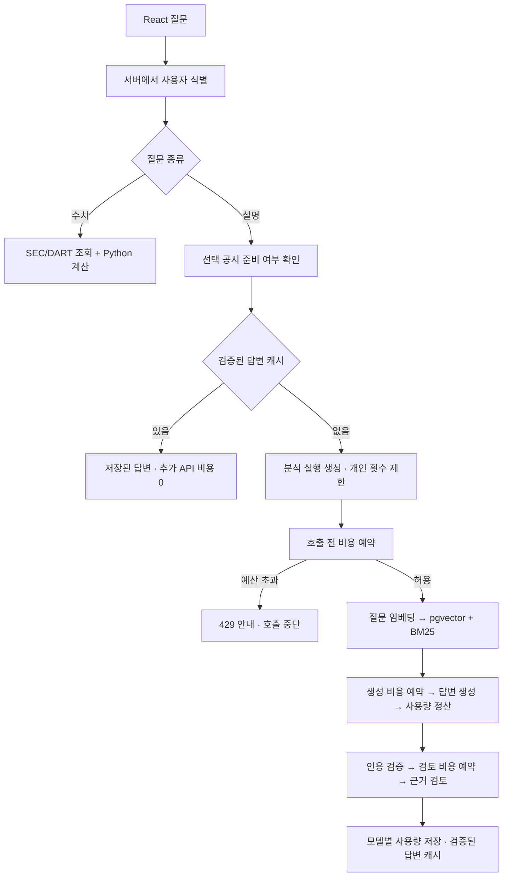

# PostgreSQL 전환과 AI 비용 제어

PostgreSQL의 저장·검색·예산 예약과 사용자별 접근 제어를 설명한다. RAG의 비용 경로를 기준으로 하며 Agent 모델 선택도 같은 예약·정산 모듈을 사용한다. 이전 실험의 관측값은 별도로 표시한다.

## 고정 RAG의 비용 흐름



새 공시의 문단 임베딩도 동일한 비용 예약 경로를 거친다. 이미 저장된 문단·벡터는 사용자들이 공유하지만 **질문과 최종 답변 캐시는 사용자별로 격리**한다.

## 실제 코드 지도

| 파일 | 읽어볼 부분 | 역할 |
|---|---|---|
| `rag/schema.sql` | FK, unique, vector(512), ai_calls | 문서 출처, 임베딩, 실행, 비용 원장 |
| `rag/store.py` | connection, dense_rank, exclusive | 연결 풀, 트랜잭션, DB 벡터 검색, 중복 작업 잠금 |
| `rag/billing.py` | operation, reserve, settle, failed | 사용자 한도, 비용 예약과 정산, 실패 비용 보존 |
| `rag/llm.py` | paid_call | 실제 OpenAI 전송 직전에 비용 제어를 강제하는 공통 경계 |
| `rag/service.py` | _index, cache_key, answer | 백그라운드 준비, 사용자/버전별 캐시, RAG 실행 |
| `auth.py` | resolve, token_user | 서버가 검증한 사용자만 유료 AI 경로로 전달 |
| `main.py` | session, prepare_rag, chat | 인증 문맥과 HTTP 응답 연결 |
| `scripts/migrate_sqlite.py` | migrate | SQLite 스냅샷 → PostgreSQL, 모든 행·벡터 대조 |
| `tests/test_cost_controls.py` | 동시 요청·타임아웃·캐시 테스트 | 외부 API를 대체하고 실제 PostgreSQL에서 실패 조건 검증 |

현재 비용·캐시·pgvector·이용 코드와 Agent 도구 선택이 구현되어 있다. Agent의 `agents/model.py`도 `rag/billing.py`로 호출 전 예약과 사용량 정산을 수행한다. 관계 데이터는 SQL 스냅샷과 Neo4j에 저장한다. 공개 회원가입·결제·SSO는 범위 밖이다.

## PostgreSQL과 pgvector가 각각 하는 일

PostgreSQL은 관계형 DB다. 문서와 문단을 FK로 연결하고, 원자적 트랜잭션으로 비용을 예약한다. pgvector는 PostgreSQL 확장이며 `vector(512)` 저장과 코사인 거리 연산을 제공한다.

기존에는 특정 공시의 모든 벡터를 Python으로 읽어 코사인 유사도를 계산했다. 이제 `store.dense_rank()`가 SQL에서 기업·공시 범위를 제한하고 가장 가까운 30개를 고른다.

```sql
SELECT c.id, 1 - (e.vector <=> :question_vector) AS similarity
FROM chunks c JOIN embeddings e ON c.id = e.chunk_id
WHERE c.document_id = :document_id
ORDER BY e.vector <=> :question_vector, c.id
LIMIT 30;
```

위 코드는 설명용 이름 있는 파라미터다. 실제 psycopg 호출은 `%s` 바인딩을 사용한다. 임의 사용자 문자열을 SQL에 붙이지 않는다.

**현재는 정확 검색이다. HNSW/IVFFlat 근사 인덱스는 추가하지 않았다.** 작은 공시 한 건 범위에서 우선 이전 Python 검색과 결과를 대조하기 위해서다. 근사 인덱스는 규모에 따라 속도를 높일 수 있지만 검색 누락과 기업/기간 필터의 영향을 함께 평가해야 한다. pgvector를 설치했다고 모든 검색이 자동으로 빨라지는 것은 아니다.

BM25와 RRF 결합은 Python에서 수행한다. 관계형 FK나 벡터 인덱스 구조와 별개로, 도메인 객체·관계의 정의와 Neo4j 투영은 `knowledge/` 모듈이 담당한다.

## 기존 데이터 이전

원본 SQLite의 backup API로 메모리 스냅샷을 만들고, 문서 → 문단 → 임베딩 → 실행 기록 순서로 하나의 PostgreSQL 트랜잭션에서 넣는다. FK를 유지하고 이미 존재하는 PK는 덮어쓰지 않는다. 같은 PK에 다른 데이터가 있으면 검증 실패로 롤백한다.

2026-09-16 이전 기록: 문서 5건, 문단 1,804건, 임베딩 1,804건, 실행 기록 26건. 이전 파서 버전의 문서도 기록으로 보존했다. 현재 검색은 해당 공시·파서·모델 버전의 문서 ID만 조회한다.

벡터는 SQLite의 float32 바이트를 읽어 pgvector에 저장한 뒤, 다시 float32로 변환하여 원본 바이트와 비교했다. 문서 내용·JSON·시각도 대조했다. 두 번 실행하여 중복 삽입 없이 재실행되는 것을 확인했다. **이전 시 OpenAI 호출 0건.** 원래 `data/processed/rag.sqlite3`는 보존했으며 런타임에서는 사용하지 않는다.

새 DB는 Docker의 `finance-detective_postgres_data` 볼륨에 저장된다. 일반적인 컨테이너 중지는 데이터를 지우지 않는다. 볼륨 삭제는 데이터 삭제이므로 임의로 실행하지 않는다.

## 왜 ‘호출 후 합산’으로는 예산을 막을 수 없나

남은 예산이 $0.01일 때 두 요청이 동시에 각각 $0.008을 쓰기로 판단하면, 단순 조회 방식은 둘 다 통과시켜 초과 지출을 일으킨다.

`reserve()`는 PostgreSQL transaction advisory lock 아래에서 다음을 함께 처리한다.

1. 실행이 아직 유효한지 확인한다.
2. 전체 일/월 비용, 사용자 일 비용, 현재 실행 비용을 계산한다.
3. **정산된 비용 + 진행 중/불확실한 예약금 + 이번 최대 예상 비용**을 한도와 비교한다.
4. 가능할 때만 `ai_calls`에 예약을 커밋한다.
5. 트랜잭션과 잠금을 해제한 다음 OpenAI를 호출한다.

잠금은 짧은 예산 검사에만 유지한다. 느린 OpenAI 응답을 기다리는 동안 전역 예산 잠금을 잡고 있지 않는다. 별도의 문서/답변 advisory lock은 중복 작업 방지용이며 비용 잠금과 목적이 다르다.

현재 전역 잠금은 이해하기 쉬운 구현이다. 모든 예약이 직렬화되므로 아주 큰 트래픽에서는 예산 집계 행, 분할된 카운터, 대기 시간 측정 등의 개선이 필요하다. 잠금이 있다는 사실만으로 대규모 운영 검증이 끝난 것은 아니다.

## 어떤 금액을 저장하나

돈은 부동소수점 달러 대신 **정수 micro-USD**로 저장한다. 1달러 = 1,000,000 micro-USD다. 요금표 계산은 Decimal을 사용하고 소수 micro-USD는 올림한다.

`ai_calls`에는 embedding/generate/review 각각의 모델, 실제 응답 모델, 입력·출력·캐시 입력 토큰, 예약금, 정산금, 공급자 응답 ID, 상태, 요금표 버전을 저장한다. `ai_requests`는 사용자와 실행을 연결하고 `runs.request_id`가 RAG 결과를 비용 실행에 연결한다.

정산 공식은 `(일반 입력 × 일반 입력 단가) + (캐시 입력 × 캐시 입력 단가) + (출력 × 출력 단가)`다. 단가는 2026-09-16에 확인한 공식 일반 API 가격이며, 지원하지 않는 모델 ID는 **요금을 추측하지 않고 호출을 차단**한다.

예약은 전송할 질문·근거·지시문·스키마의 UTF-8 바이트 수에 프레이밍 여유분을 더해 입력 토큰 상한을 보수적으로 잡고, 출력은 `max_output_tokens` 전부를 예약한다. 실제 응답의 usage가 오면 더 작은 실제 추정 비용으로 정산한다. 일반적인 text-only 경로와 현재 허용 모델에 한정한 정책이며 이미지·도구별 과금 모델을 추가하려면 예약 방식도 수정해야 한다.

정확한 회계 청구액과 동일하다고 주장하지 않는다. 환율·세금·서버·DB, 다른 프로젝트/앱이 같은 API 키로 쓴 비용은 포함하지 않는다. **이전 26개 실행은 생성/검토 사용량을 합쳐 저장했으므로 비용을 소급 추정하지 않았다. 새 한도는 비용 제어 적용 이후의 호출부터 관리한다.**

## 실패해도 이미 사용한 토큰은 사라지지 않는다

- 모델 응답이 왔지만 JSON/인용/근거 검증에 실패: 사용량부터 정산하고 결과를 유보한다. 실패 응답은 캐시하지 않는다.
- 인증·입력·한도 거절 등 명시적인 미처리 HTTP 오류: 예약금을 0으로 정산한다.
- 시간 초과·연결 단절·처리 여부가 불확실한 서버 오류: `uncertain`으로 표시하고 예약금은 유지한다. 같은 요청을 자동 재시도하지 않는다.
- 프로세스 중단: 15분 지난 active 실행은 다음 실행 검사에서 종료 처리하되, 그 실행의 미정산 비용은 계속 보유한다. 만료된 실행은 새 유료 호출을 할 수 없다.
- DB 정산 자체가 실패: 추가 AI 처리를 진행하지 않고, 커밋된 예약을 남긴다.

불확실한 금액은 OpenAI 사용 내역/응답 ID와 대조해 운영자가 확인해야 한다. 자동으로 ‘오류니까 무료’ 처리하지 않는다. 한도 검사 전에는 아직 다음 호출 전체를 감당할 금액이 있어야 하므로 실제 누적 비용이 한도보다 작아도 차단될 수 있다.

## 사용자별 한도가 실제로 의미 있으려면

브라우저가 보내는 `user_id`나 임의 UUID를 신뢰하면 새 ID를 만들어 한도를 피할 수 있다. 지금은 두 모드가 있다.

- `local`: 실제 접속 IP와 Host가 loopback인 요청만 `local-owner`로 처리한다. 로컬 서버는 `--no-proxy-headers`로 실행한다. 로컬 방문자를 각각 다른 사람이라고 주장하지 않는다.
- `token`: 서버가 발급한 충분히 긴 이용 코드를 SHA-256 해시로 DB에 보관한다. 브라우저는 코드 입력 후 HttpOnly / SameSite=Strict 쿠키를 사용한다. HTTPS에서는 Secure도 설정된다. API 클라이언트는 Bearer 헤더를 사용할 수 있다. 사용자 ID는 이 검증 결과에서만 나온다.

외부 배포는 token + HTTPS가 전제다. reverse proxy가 loopback으로 접속하므로 local 모드를 외부 배포에 사용하면 안 된다. Origin이 다른 브라우저 요청도 거절한다. 사용자 코드 재발급/disabled 상태는 기존 접근을 무효화한다.

초대 코드 방식은 작은 데모용 접근 제어다. 회원가입, 비밀번호 복구, SSO, 결제, 고객별 차등 요금제는 아직 없다. 코드 공유 시 같은 사용자 한도를 공유하므로 ‘사람 한 명’을 보장하는 본인 인증은 아니다.

## 답변 캐시의 경계

캐시 키에 사용자, 공시 ID/원문 해시, 정규화된 질문, 제공된 재무 수치/통화/범위, 생성·검토 모델, 프롬프트 버전, 검색 버전을 포함한다. 공시 문서는 이미 파서·임베딩 모델·차원별로 구분되어 있다.

검증을 통과한 answered만 24시간 저장한다. 다른 사용자·연도·공시·모델·프롬프트는 재사용하지 않는다. 유사한 질문이라는 이유만으로 재사용하는 semantic cache는 사용하지 않았다. 같은 질문이 동시에 들어오면 DB 잠금으로 중복 모델 호출을 막는다.

캐시 응답은 AI API 호출이 없으며 추가 비용/토큰 0으로 표시한다. 이전 생성 실행은 `source_run_id`로 추적한다. 일반 DB·서버 처리 비용까지 0이라는 뜻은 아니다. 캐시 읽기는 AI 일일 분석 횟수를 소모하지 않는다. 현재 만료된 행은 읽기에서 제외하며 정기 삭제 작업은 별도 운영 과제다.

## 기본 설정과 검증

- 전체 일 $5 / 월 $30, 사용자 일 $1 / 50회, 실행당 $0.15.
- 같은 사용자 동시 실행 1건, 전체 동시 실행 4건. 공시 준비 작업은 프로세스당 최대 2건.
- 횟수는 새 공시 준비와 새 답변 분석 각각 1회, 실패한 실행도 포함. 단순 수치 조회·캐시 응답은 제외.
- 일/월 경계는 UTC. `AI_*_BUDGET_USD=0`이면 해당 범위에서 새 유료 호출을 중단한다.

2026-09-16 쿠팡 공시 질문의 관측 기록:

| 호출 | 결과 | 추정 API 비용 | 관측 응답 시간 |
|---|---|---:|---:|
| 첫 질문 | 임베딩 + 생성 + 근거 검토 | $0.005783 | 8.674초 |
| 동일 질문 재요청 | 사용자별 답변 캐시 | $0 | 0.029초 |

한 번의 로컬 관측이며 평균/보장치가 아니다. 같은 답변 재사용 효과이고 PostgreSQL 자체의 성능 개선 수치로 해석하면 안 된다. 원본 실행 기록은 무시되는 `data/processed/postgres-live-check.json`에 있다.

해당 구현 단계에서 테스트 56개와 프런트엔드 빌드가 통과했다. 삼성전자 DART 공시도 실제 질문에서 근거 2개를 포함해 응답했고 생성·검토·질문 임베딩 추정 비용은 $0.015548이었다. 현재 검사 결과는 [CI](https://github.com/junyongs0728/finance-detective/actions/workflows/verify.yml), 평가 범위는 [평가 문서](evaluation.md)를 기준으로 확인한다.

테스트는 실제 PostgreSQL의 격리된 임시 스키마와 합성 API 응답을 사용한다. 기업·공시 범위, 벡터 순위, 동시 예산 경쟁, 개인/전체 한도, 캐시 격리/만료, 토큰 없는 요청, CSRF Origin, 타임아웃 예약, 잘못된 답변의 과금 보존 등을 검증한다.

## 운영 전 확인할 조건

1. 원가: 모델별 비용과 실패 비용이 누락되는 경로가 있는가? OpenAI 청구 내역과 차이가 나는가?
2. 동시성: 요청 수 증가 때 예산 잠금 대기와 연결 풀 고갈이 발생하는가? 여러 서버에서도 같은 한도가 적용되는가?
3. 검색: 기업/기간 필터를 유지하는가? ANN 도입 후 관련 근거 검색 성공률이 떨어지지 않는가?
4. 캐시: 정정 공시, 프롬프트 변경, 사용자 변경 후 오래된 답변이 섞이는가?
5. 운영: DB 백업/복구, 일반 앱 계정과 migration 권한 분리, 보존 기간, 배포 인증, 가격 변경 절차가 있는가?

Docker의 현재 DB 계정은 로컬 편의를 위한 관리 권한을 가진다. 운영 배포에서는 schema migration 계정과 앱 계정의 권한을 나누어야 한다. 지금 구현은 공개 대규모 서비스 운영 검증 완료를 뜻하지 않는다.

## 공식 참고

- [pgvector: 정확/근사 검색과 필터](https://github.com/pgvector/pgvector)
- [Psycopg 연결 풀](https://www.psycopg.org/psycopg3/docs/advanced/pool.html)
- [PostgreSQL advisory lock](https://www.postgresql.org/docs/current/explicit-locking.html)
- [OpenAI GPT-4.1 mini 요금](https://developers.openai.com/api/docs/models/gpt-4.1-mini)
- [OpenAI GPT-4.1 요금](https://developers.openai.com/api/docs/models/gpt-4.1)
- [OpenAI 임베딩 요금](https://developers.openai.com/api/docs/models/text-embedding-3-small)
