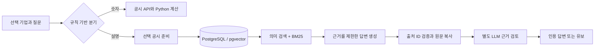

# RAG: 공시 검색·생성·근거 검증

현재 PostgreSQL/pgvector 기반의 공통 검색·생성·검증 모듈을 설명한다. UI의 ‘공시 검색 답변’은 고정 RAG 경로이며, 기본 Agent 모드도 검색 도구와 최종 설명 단계에서 같은 모듈을 사용한다. 전체 구조는 [아키텍처](architecture.md), 도구 선택은 [Agent·Graph 가이드](agent-graph-guide.md)를 참고한다.

## 사용해보기

기업 검색에서 삼성전자 또는 애플을 선택하고 ‘공시 검색 답변’ 모드로 다음과 같이 질문한다.

- 삼성전자: `주요 사업을 공시 근거로 설명해줘`
- 애플: `주요 사업 위험 요인 두 가지를 공시 근거로 설명해줘`
- 답변 유보 확인: `공시에 기록된 달 표면 오프라인 매장 사업을 설명해줘`

첫 설명 질문은 선택한 공시의 서술문을 내려받아 색인한다. 준비 진행률이 보이고 준비가 끝나면 질문을 이어서 처리한다. 숫자만 묻는 질문은 기존 구조화 데이터와 계산 코드로 처리한다.

## 흐름과 실제 파일



| 코드 | 실제 책임 | 읽을 질문 |
|---|---|---|
| `chat.py:answer` | 숫자/설명 분기, 기업·기간 확인 | 숫자 조회에 LLM 비용이 발생하지 않는 이유는? |
| `rag/documents.py` | SEC HTML 또는 DART 본 XML 수집, 서술문 추출·분할 | 본문 누락과 표 구조 손실을 어떻게 다루는가? |
| `rag/store.py` | SQL 스키마, 트랜잭션, 외래키, 임베딩 저장 | 문단이 어느 공시 소속인지 어떻게 보장하는가? |
| `rag/search.py` | 공시 범위 제한, 임베딩 유사도·BM25 순위 결합 | 회사 필터는 검색 전과 후 중 언제 적용하는가? |
| `rag/llm.py` | 생성 프롬프트, 출력 스키마, 검토 프롬프트 | 프롬프트와 구조 검증의 책임은 어떻게 다른가? |
| `rag/validation.py` | ID 검증, 원문 위치를 실제 인용문으로 변환 | 인용문을 모델에게 쓰게 하지 않는 이유는? |
| `rag/service.py` | 준비·검색·생성·검증 순서와 상태 기록 | 실패 시 어디까지 완료했는지 확인할 수 있는가? |

고정 RAG는 검색·생성·검토를 정해진 순서로 실행한다. `agents/`는 모델이 도구를 선택하는 별도 경로이며, 문단 검색과 답변 검증을 이 모듈에 위임한다.

## SQL이 맡는 역할

PostgreSQL에 다음 데이터를 저장한다. 전체 정의는 [`rag/schema.sql`](../src/finance_detective/rag/schema.sql)에 있다.

- `documents`: 회사 ID, 공시 번호, 출처, 기준 기간, 파서 버전, 임베딩 모델·차원, 상태, 원문 해시.
- `chunks`: 공시 외래키, 문단 순번, 절 제목, 원문 텍스트, 텍스트 해시.
- `embeddings`: 문단 외래키와 pgvector `vector(512)`. 외래키가 없는 벡터는 저장할 수 없다.
- `runs`: 질문, 검색된 문단 ID, 생성/검토 결과, 모델·프롬프트 버전, 토큰 수, 지연 시간.

공시 ID는 `기업 + 접수번호 + 파서 버전 + 임베딩 모델 + 차원`으로 결정한다. 다른 모델의 벡터를 섞지 않는다. 인덱스 실패 후 재시도하면 완료된 임베딩 배치를 재사용한다. 같은 로컬 프로세스에서 회사 공시별 중복 준비를 막고 최대 2건을 동시에 준비한다.

현재 벡터 순위는 PostgreSQL의 코사인 거리 연산으로 구한다. 한 공시의 작은 문단 집합에 정확 검색을 적용하며 HNSW/IVFFlat 인덱스는 없다. BM25와 RRF는 Python에서 실행한다. SQLite는 초기 구현의 이전 도구에만 남아 있으며 런타임 저장소로 사용하지 않는다.

읽기 전용으로 확인할 SQL 예:

```sql
SELECT company_id, accession, status, chunk_count, embedded_count
FROM documents ORDER BY updated_at DESC;

SELECT id, status, model, prompt_version, input_tokens, output_tokens, latency_ms
FROM runs ORDER BY created_at DESC LIMIT 10;

SELECT d.company_id, d.accession, c.ordinal, c.section
FROM chunks c JOIN documents d ON d.id=c.document_id
WHERE d.id = '확인한_공시_ID' ORDER BY c.ordinal;
```

## 검색 설계

1. **필터 먼저:** 선택된 공시 ID의 문단만 SQL로 가져온다. 전체 기업에서 검색한 뒤 회사명을 확인하는 방식이 아니다.
2. **문서/질문 임베딩:** 기본 `text-embedding-3-small`, 512차원. 임베딩 모델은 답변 생성 모델과 다르다. 한글 질문과 영어 공시를 의미 공간에서 비교할 수 있지만 품질은 별도 평가해야 한다.
3. **질의 보강:** 주요 사업·위험·현금흐름·매출 질문에 정해진 영어 검색어를 추가한다. 일반 번역 모델은 아니며 실제 질문과 보강된 검색어를 구분해 로그에 남긴다. 한글 질문만으로 영문 공시를 찾을 때 생긴 누락을 개선하려는 기준선이다.
4. **어휘 검색:** BM25 기준선도 유지한다. 한국어는 단순 글자 bigram으로 나눠 조사 변화에 일부 대응한다. 형태소 분석기는 아니다.
5. **순위 결합:** 서로 다른 스케일의 점수를 그대로 더하지 않고 Reciprocal Rank Fusion으로 결합한다. 각 검색의 상위 30개 후보를 결합해 6개를 답변에 전달한다.
6. **유보:** 검색 점수는 답변 신뢰도가 아니다. 관련 문단이 반환돼도 답할 근거가 없으면 유보한다.

기본 문단 길이는 1,400자, 긴 문단은 1,200자 간격으로 나눈다. 같은 절의 짧은 문단은 묶는다. 최적의 길이라고 주장하지 않는다. 길이·겹침·검색 개수·임베딩 차원은 평가 데이터로 비교할 튜닝 항목이다.

## Prompt Engineering이 코드가 되는 지점

`rag/llm.py`의 `PROMPT`는 역할, 기업/공시 범위, 문서의 비신뢰성, 기간 구분, 원인 설명의 조건, 답변 유보를 규정한다. 사용자 질문과 공시 문장은 데이터로 전달하고 그 안의 지시문을 따르지 않도록 한다.

출력은 자유로운 문단 하나가 아니라 다음 구조다.

```json
{
  "status": "answered",
  "claims": [{
    "text": "공시에 근거한 한국어 설명",
    "citations": [{"evidence_id": "문단_ID", "span_id": "문단_ID@원문범위번호"}]
  }],
  "limitations": "검색 범위의 한계"
}
```

모델이 선택한 `span_id`는 서버가 제공한 원문 범위 중 하나여야 한다. **인용문과 URL은 모델이 만들지 않는다.** Python이 실제 원문을 그대로 복사하고 저장된 공시 URL을 붙인다.

Structured Outputs는 JSON 형식 준수에 도움이 된다. 진실성을 보장하지 않으므로 Python에서 상태/주장/출처 ID를 검증한 뒤, 다른 호출로 근거 검토를 수행한다. 검토가 실패하면 후보 주장을 사용자에게 사실처럼 보여주지 않는다. 거절된 후보와 검토 내용은 SQL 실행 기록에 남긴다. 모델의 `limitations` 자유 서술은 추가 사실을 전달하지 않도록 화면에 그대로 표시하지 않고 서버가 검색 범위 안내를 작성한다.

기본 생성 모델은 `gpt-4.1-mini`, 검토 모델은 `gpt-4.1`이다. 환경변수로 바꿀 수 있고 실제 응답 모델은 비용 기록에 남긴다. RAG 호출의 응답 저장 옵션은 `store=False`, 자동 SDK 재시도는 0, 호출 시간 제한은 45초다. 캐시가 없는 정상 고정 RAG 경로는 질의 임베딩 1회, 생성 1회, 답변 가능한 경우 근거 검토 1회다. 최초 문서 임베딩과 Agent 도구 선택·추가 검색은 별도다. 질문을 포함한 SQL 실행 데이터와 DB 볼륨은 저장소에 포함하지 않는다.

## 실제 실패로 바뀐 설계

### 실패 1: 공시를 일부만 읽음

삼성전자 원문을 일반 XML 파서로 읽었을 때 뒤쪽 내용이 잘렸다. 같은 원문을 HTML 호환 파서로 읽자 후반부 절과 주석을 확인할 수 있었다. 사용자 입력 명령을 실행하지 않으며 스크립트와 숨겨진 XBRL 메타데이터를 제외한다. 후반부 절이 살아 있는지 회귀 테스트로 확인한다.

### 실패 2: 모델이 인용문을 재작성함

첫 모델 응답은 원문에 있는 “회사 및 종속기업…”을 “회사…”로 바꿔 인용했다. 문자열 검증이 이를 차단했다. 검증을 느슨하게 하는 대신, 모델이 원문 위치 ID만 선택하게 바꿨다. 인용문은 코드가 복사한다.

### 실패 3: 인용은 맞지만 설명은 틀림

현금흐름표를 평탄화한 텍스트에서 모델이 부호/방향을 잘못 해석하고 항목 나열을 실제 변동 원인처럼 설명했다. 출처가 있다는 사실만으로 설명이 올바르지는 않았다.

이를 줄이기 위해 새 RAG에서는 표 자체를 제외했다. 수치는 기존 구조화 API와 계산 코드로 제공하고, 원인 설명에는 회사가 명시한 서술 근거를 요구한다. 별도 LLM 검토도 추가했다. 이 선택은 재무 주석 등 표 안의 설명을 놓칠 수 있다는 손해가 있다. 표 구조를 보존하는 추출과 행/열/기간 검증은 후속 과제다.

### 실패 4: 올바른 답을 검토 모델이 거절함

쿠팡 공시가 직접 나열한 브랜드를 검토 모델이 자신의 과거 지식과 비교해 거절하는 사례가 있었다. 검토 프롬프트가 외부 지식을 배제하도록 강화하고, 생성 모델보다 큰 별도 검토 모델로 분리했다. 실제 소량 검증에서 개선됐지만, 체계적인 모델 비교나 오류율 감소를 입증한 것은 아니다. 과도한 유보 역시 평가 대상이다.

## 현재 범위와 평가 해석

초기 개발 평가의 준비 결과는 삼성전자 95개, 애플 213개, 쿠팡 482개 서술 문단이었다. 공시·파서가 바뀌면 개수도 달라진다. 이전 파서의 표 포함 색인은 별도 버전으로 남으며 새 검색에는 섞이지 않는다. 표·표 내부 문단·첨부·이미지/OCR는 범위 밖이다. 원문 크기 40MB, 최대 1,600개 문단, 기본 반환 6개 등의 한도를 둔다.

- 오프라인 검사: 기업/공시 혼입 차단, SQL 트랜잭션 롤백, 외래키, 가짜 인용 ID 거부, 원문 복사, 표 배제, 검토 실패 시 유보.
- 실제 개발 평가: 삼성전자 사업(기업명 명시/일반 질문), 애플 위험, 쿠팡 사업, 없는 정보 질문 2개, 기업/기간 범위 위반 2개. 최종 8개 사례의 기대 상태 및 인용문 검사가 통과했다. 결과는 `evals/rag-report.json`에 기록한다.
- 위 결과는 검색 재현율이나 환각률 수치가 아니다. 숨겨진 검증 집합도 아니고 완전한 의미 정확성 평가도 아니다. 다른 모델을 쓰더라도 동일 계열 모델의 검토 오류가 서로 연관될 수 있다.

다음 과제는 질문-정답 근거 쌍을 늘려 BM25 단독/임베딩 단독/하이브리드를 비교하고, 잘못된 답변과 과도한 유보를 각각 측정하는 것이다. 재실행 방법과 과거 결과의 해석 범위는 [평가 문서](evaluation.md)에 있다.

## 공식 자료

- [OpenAI Structured Outputs](https://developers.openai.com/api/docs/guides/structured-outputs)
- [OpenAI Embeddings](https://developers.openai.com/api/docs/guides/embeddings)
- [OpenDART 공시서류 원본파일](https://opendart.fss.or.kr/guide/detail.do?apiGrpCd=DS001&apiId=2019003)
